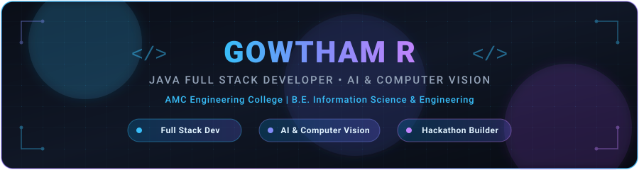
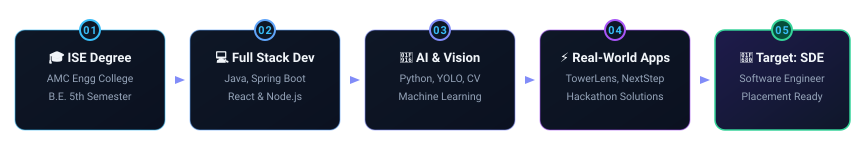

<div align="center">

<<<<<<< HEAD
<!-- HERO BANNER -->
<a href="https://github.com/gowtham-cr">
  
</a>

<br /><br />

<!-- ABOUT & SYSTEM DOSSIER -->


<br /><br />

<!-- 3D TECH ARSENAL & ORBIT ARCHITECTURE -->


<br /><br />

<!-- HOLOGRAPHIC 3D ID CARD & TELEMETRY DASHBOARD -->


<br /><br />

<!-- TRANSMISSION TERMINAL & CONNECT PORTAL -->
<a href="https://github.com/gowtham-cr">
  
</a>

<br /><br />

---

### 🛰️ Transmission Data & Direct Coordinates

```bash
$ identity --query gowtham-cr
  NAME       : Gowtham R
  LOCATION   : Bengaluru, Karnataka, India (IST / UTC+5:30)
  DEPARTMENT : Information Science & Engineering
  CORE_FOCUS : Java Full Stack Architecture • AI/ML & Computer Vision • Hackathons
  STATUS     : OPEN FOR SOFTWARE ROLES, AI INITIATIVES & HACKATHONS
```

<!-- FOOTER BADGES (THEMED IN DEEP NAVY, ELECTRIC BLUE & CRIMSON) -->
<p align="center">
  <a href="https://github.com/gowtham-cr">
    
  </a>
  &nbsp;
  
  &nbsp;
  
</p>

<sub>Crafted with custom 3D vector engineering &amp; GitHub Profile Playbook standards • © 2026 Gowtham R</sub>

</div>
=======
  <!-- Profile Avatar -->
  <a href="https://github.com/gowtham-cr">
    
  </a>

  <br/><br/>

  <!-- Header Banner -->
  

  <br/><br/>

  <!-- Animated Typing Headline -->
  <a href="https://github.com/gowtham-cr">
    
  </a>

  <br/><br/>

  <!-- Badges Row -->
  <p align="center">
    
    
    
    
  </p>

  <!-- Quote Banner -->
  

</div>

<br/>

<p align="center">
  
</p>

<!-- =================================================== -->
<!-- ABOUT ME SECTION -->
<!-- =================================================== -->
<h2 align="center">👨‍💻 About Me</h2>

<p align="center">
  Hello World! I'm <b>Gowtham R</b>, an enthusiastic <b>Information Science &amp; Engineering</b> undergraduate (5th Semester) at <b>AMC Engineering College</b> with a passion for architecting end-to-end software solutions.
</p>

<table align="center" width="100%">
  <tr>
    <td width="50%" valign="top">
      <h3>💡 What Drives Me</h3>
      <ul>
        <li>☕ <b>Full Stack Craftsmanship</b>: Dedicated to <b>Java Full Stack Development</b>, building reactive frontends with <b>React &amp; Tailwind CSS</b> and robust backend architectures with <b>Spring Boot, Node.js &amp; Express</b>.</li>
        <li>🤖 <b>Applied AI &amp; Computer Vision</b>: Passionate about <b>Artificial Intelligence &amp; Machine Learning</b>, specializing in computer vision pipelines using <b>OpenCV</b> and <b>YOLO</b>.</li>
        <li>⚡ <b>Real-World Utility</b>: Focused on creating practical web applications and AI tools that solve everyday problems with clean, scalable code.</li>
      </ul>
    </td>
    <td width="50%" valign="top">
      <h3>🎯 Career Objective &amp; Vision</h3>
      <ul>
        <li>🚀 <b>Aspiring SDE</b>: Preparing rigorously for <b>software engineering campus placements</b> by mastering software engineering fundamentals and modern application stacks.</li>
        <li>🏆 <b>Hackathon Builder</b>: Enthusiastic hackathon participant who loves turning complex real-world problems into working software prototypes under pressure.</li>
        <li>📈 <b>Engineering Excellence</b>: Committed to writing clean, maintainable code, adopting industry best practices, and continuously expanding technical depth.</li>
      </ul>
    </td>
  </tr>
</table>

<br/>

<p align="center">
  
</p>

<!-- =================================================== -->
<!-- AREAS OF INTEREST -->
<!-- =================================================== -->
<h2 align="center">💡 Areas of Interest</h2>

<p align="center">
  
  &nbsp;
  
  &nbsp;
  
  &nbsp;
  
  &nbsp;
  
  &nbsp;
  
</p>

<br/>

<p align="center">
  
</p>

<!-- =================================================== -->
<!-- TECHNICAL SKILLS -->
<!-- =================================================== -->
<h2 align="center">🛠️ Technical Skills</h2>

<p align="center">
  
</p>

<br/>

<table align="center" width="100%">
  <thead>
    <tr>
      <th width="28%" align="left">Domain</th>
      <th width="72%" align="left">Technologies &amp; Tools</th>
    </tr>
  </thead>
  <tbody>
    <tr>
      <td><b>💻 Programming</b></td>
      <td>
        
        
        
        
        
      </td>
    </tr>
    <tr>
      <td><b>🌐 Frontend</b></td>
      <td>
        
        
        
      </td>
    </tr>
    <tr>
      <td><b>⚙️ Backend &amp; APIs</b></td>
      <td>
        
        
        
        
      </td>
    </tr>
    <tr>
      <td><b>🗄️ Databases</b></td>
      <td>
        
        
      </td>
    </tr>
    <tr>
      <td><b>🤖 AI / ML &amp; Vision</b></td>
      <td>
        
        
        
        
        
      </td>
    </tr>
    <tr>
      <td><b>🛠️ Developer Tools</b></td>
      <td>
        
        
        
        
        
        
      </td>
    </tr>
  </tbody>
</table>

<br/>

<p align="center">
  
</p>

<!-- =================================================== -->
<!-- FEATURED PROJECTS -->
<!-- =================================================== -->
<h2 align="center">🚀 Featured Projects</h2>

<table align="center" width="100%">
  <tr>
    <td width="50%" valign="top">
      <h3>🏗️ TowerLens AI</h3>
      <p><i>AI-Powered Tower Component Detection System</i></p>
      <p>An intelligent computer vision system engineered for automated structural inspection and detection of telecom/transmission tower components.</p>
      <ul>
        <li><b>Deep Learning Detection</b>: Leverages <b>YOLO</b> models for real-time bounding-box detection of structural elements.</li>
        <li><b>Image Processing</b>: Employs <b>OpenCV</b> pipelines for image filtering, preprocessing, and feature extraction.</li>
        <li><b>Full-Stack Architecture</b>: High-speed <b>FastAPI</b> backend paired with a reactive <b>React</b> frontend dashboard.</li>
      </ul>
      <p>
        <code>YOLO</code> &nbsp; <code>OpenCV</code> &nbsp; <code>Python</code> &nbsp; <code>FastAPI</code> &nbsp; <code>React</code>
      </p>
    </td>
    <td width="50%" valign="top">
      <h3>🎯 NextStep AI</h3>
      <p><i>AI Placement Readiness Copilot for Students</i></p>
      <p>A comprehensive AI assistant engineered to guide students through the recruitment lifecycle, bridging academic preparation and career opportunities.</p>
      <ul>
        <li><b>Smart Resume Feedback</b>: Automated review and actionable suggestions for resume optimization.</li>
        <li><b>Skill-Gap Analysis</b>: Identifies missing technical competencies and recommends targeted study paths.</li>
        <li><b>Placement Prep</b>: Comprehensive modules for coding preparation, mock interview practice, and internship matching.</li>
      </ul>
      <p>
        <code>AI / ML</code> &nbsp; <code>NLP</code> &nbsp; <code>Python</code> &nbsp; <code>React</code> &nbsp; <code>Web Apps</code>
      </p>
    </td>
  </tr>
  <tr>
    <td width="50%" valign="top">
      <h3>🤖 AMC College AI Chatbot</h3>
      <p><i>Intelligent Campus Assistance System</i></p>
      <p>A specialized conversational AI chatbot developed to deliver 24/7 college-related assistance for students, faculty, and visitors at AMC Engineering College.</p>
      <ul>
        <li><b>Instant Query Resolution</b>: Handles queries regarding academic schedules, syllabus, department contacts, and campus facilities.</li>
        <li><b>Student Navigation</b>: Streamlines access to important announcements, exam timetables, and resource portals.</li>
        <li><b>Interactive UI</b>: Clean, responsive user experience optimized for fast access on desktop and mobile.</li>
      </ul>
      <p>
        <code>AI Chatbot</code> &nbsp; <code>Python</code> &nbsp; <code>Full Stack</code> &nbsp; <code>REST APIs</code>
      </p>
    </td>
    <td width="50%" valign="top">
      <h3>📦 Inventory Management System</h3>
      <p><i>Full-Stack Employee &amp; Asset Management Application</i></p>
      <p>A complete full-stack enterprise web application designed to track, allocate, and audit organizational inventory and employee hardware assets.</p>
      <ul>
        <li><b>End-to-End Workflows</b>: Complete CRUD operations engineered with <b>React</b>, <b>Node.js</b>, and <b>Express.js</b>.</li>
        <li><b>Relational Schema</b>: Robust data modeling and query optimization using <b>MySQL</b>.</li>
        <li><b>RESTful Endpoints</b>: Secure, modular API architecture providing seamless data communication.</li>
      </ul>
      <p>
        <code>React</code> &nbsp; <code>Node.js</code> &nbsp; <code>Express.js</code> &nbsp; <code>MySQL</code> &nbsp; <code>REST APIs</code>
      </p>
    </td>
  </tr>
  <tr>
    <td colspan="2" valign="top">
      <h3>🏥 AI Disease Prediction System</h3>
      <p><i>Machine Learning Healthcare Risk Prediction Platform</i></p>
      <p>An intelligent healthcare predictive application designed to forecast disease risks based on patient clinical parameters and symptoms.</p>
      <ul>
        <li><b>Predictive Modeling</b>: Implements supervised <b>Machine Learning</b> classification algorithms for predictive risk analysis.</li>
        <li><b>Clinical Data Processing</b>: Structured feature extraction, data preprocessing, and model evaluation in <b>Python</b>.</li>
        <li><b>Diagnostic Assistance</b>: Intuitive interface delivering clear, interpretable health insight reports to assist users.</li>
      </ul>
      <p>
        <code>Python</code> &nbsp; <code>Machine Learning</code> &nbsp; <code>Predictive Modeling</code> &nbsp; <code>Healthcare AI</code>
      </p>
    </td>
  </tr>
</table>

<br/>

<p align="center">
  
</p>

<!-- =================================================== -->
<!-- DEVELOPER JOURNEY -->
<!-- =================================================== -->
<h2 align="center">🧑‍💻 Developer Journey</h2>

<p align="center">
  
</p>

<table align="center" width="100%">
  <tr>
    <td width="20%" align="center" valign="top">
      <b>Step 01: Academics</b><br/>
      <sub>Foundational CS &amp; ISE at AMC Engineering College (5th Sem)</sub>
    </td>
    <td width="20%" align="center" valign="top">
      <b>Step 02: Full Stack</b><br/>
      <sub>Mastering Java, Spring Boot, Node.js, Express, React &amp; SQL</sub>
    </td>
    <td width="20%" align="center" valign="top">
      <b>Step 03: AI &amp; Vision</b><br/>
      <sub>Specializing in Python, ML, OpenCV &amp; YOLO Object Detection</sub>
    </td>
    <td width="20%" align="center" valign="top">
      <b>Step 04: Real-World Apps</b><br/>
      <sub>Building TowerLens AI, NextStep AI &amp; building at Hackathons</sub>
    </td>
    <td width="20%" align="center" valign="top">
      <b>Step 05: Career Goal</b><br/>
      <sub>Targeting Software Engineering &amp; SDE Placements 🚀</sub>
    </td>
  </tr>
</table>

<br/>

<p align="center">
  
</p>

<!-- =================================================== -->
<!-- HACKATHONS & BUILDING ETHOS -->
<!-- =================================================== -->
<h2 align="center">🏆 Hackathons &amp; Engineering Ethos</h2>

<table align="center" width="100%">
  <tr>
    <td width="25%" align="center" valign="top">
      <h3>⚡ Rapid Prototyping</h3>
      <p>Translating conceptual ideas into working MVPs within tight 24-48 hour hackathon clocks.</p>
    </td>
    <td width="25%" align="center" valign="top">
      <h3>🧩 Problem Solving</h3>
      <p>Focusing on high-impact pain points and engineering reliable, practical software solutions.</p>
    </td>
    <td width="25%" align="center" valign="top">
      <h3>🤝 Agile Collaboration</h3>
      <p>Thriving in multidisciplinary engineering teams through clear communication and git workflows.</p>
    </td>
    <td width="25%" align="center" valign="top">
      <h3>🔬 Modern Tech Stacks</h3>
      <p>Integrating cutting-edge AI/vision models with full-stack interfaces to maximize project impact.</p>
    </td>
  </tr>
</table>

<br/>

<p align="center">
  
</p>

<!-- =================================================== -->
<!-- CURRENT GOALS -->
<!-- =================================================== -->
<h2 align="center">🎯 Current Goals &amp; Focus</h2>

<table align="center" width="100%">
  <tr>
    <td width="50%" valign="top">
      <ul>
        <li>🎓 Maintain academic excellence in <b>5th Semester B.E. ISE</b> at AMC Engineering College</li>
        <li>☕ Deepen mastery of <b>Java Full Stack Development</b> &amp; enterprise <b>Spring Boot</b></li>
        <li>🤖 Advance computer vision skills with <b>YOLO object detection</b> and <b>OpenCV</b></li>
      </ul>
    </td>
    <td width="50%" valign="top">
      <ul>
        <li>🧠 Rigorous practice of <b>Data Structures &amp; Algorithms (DSA)</b> for technical rounds</li>
        <li>🏆 Actively compete in upcoming collegiate and national <b>hackathons</b></li>
        <li>🚀 Prepare comprehensively for upcoming <b>software engineering placements</b></li>
      </ul>
    </td>
  </tr>
</table>

<br/>

<p align="center">
  
</p>

<!-- =================================================== -->
<!-- GITHUB STATS & ACTIVITY -->
<!-- =================================================== -->
<h2 align="center">📊 GitHub Statistics &amp; Activity</h2>

<div align="center">
  <table border="0" align="center">
    <tr>
      <td align="center">
        <a href="https://github.com/gowtham-cr">
          
        </a>
      </td>
      <td align="center">
        <a href="https://github.com/gowtham-cr">
          
        </a>
      </td>
    </tr>
  </table>

  <br/>

  <a href="https://github.com/gowtham-cr">
    
  </a>

  <br/><br/>

  <!-- Contribution Graph Snake -->
  

</div>

<br/>

<p align="center">
  
</p>

<!-- =================================================== -->
<!-- CONNECT SECTION -->
<!-- =================================================== -->
<h2 align="center">🤝 Let's Connect &amp; Collaborate</h2>

<p align="center">
  I am always open to discussing new opportunities, collaborating on open-source projects,
  exchanging ideas on <b>Full Stack Development &amp; AI/ML</b>, or teaming up for <b>hackathons</b>!
</p>

<p align="center">
  <a href="https://github.com/gowtham-cr">
    
  </a>
  &nbsp;
  <a href="https://github.com/gowtham-cr?tab=repositories">
    
  </a>
  &nbsp;
  <a href="https://github.com/gowtham-cr?tab=stars">
    
  </a>
</p>

<p align="center">
  ⭐ <i>If you find my repositories helpful or interesting, consider leaving a star on GitHub!</i>
</p>

<br/>

<!-- Footer Banner -->
<div align="center">
  
</div>
>>>>>>> 38da5f64a76c8e54805c3c8067cfa6fc7430e6f6
